# Explainable Artificial Intelligence for Authorship Attribution on Social Media

This page contains supplementary materials of our submitted ICASSP'22 paper (under revision), "_Explainable Artificial Intelligence for Authorship Attribution on Social Media_."

We present results from experiments running predictions from two models for authorship attribution of small messages described below:

1. Theophilo et al. - Authorship Attribution of Social Media Messages. IEEE Transactions on Computational Social Systems. 2021. IEEE.
1. Rocha et al. - Authorship attribution for social media forensics. IEEE transactions on information forensics and security. 2016. IEEE.

## Section 4.1. Dataset Organization

We generated predictions for all samples in the validation set and, from these samples, we defined, for each model, two subsets for which to generate LIME explanations. The first (RAND) has 1,000 messages randomly chosen (20 messages from each one of the 50 authors), and the second (T-CONF) is the set of all correct predictions with high confidence ($>$ 0.9), consisting of a subset of 2977 samples for the model [1] and 451 samples for model [2].

## Section 4.2. Interpretation Evaluation

Here we present a comparison of the explanations offered by the standard unigram LIME method and our proposed LIME extension using character n-grams. For each pair of images representing an example, the standard unigram LIME explanation is the image above, and the proposed LIME extension is below.

In all comparisons, we observed a scenario with little overlap between the most relevant unigrams and character 4-grams. However, the most significant finding is that the most relevant character 4-grams encompass spaces and punctuation, which are ignored by design by the unigram representation. This highlights the type of characteristics learned by the attribution model, emphasizing its focus on writing patterns rather than semantic. Additionally, it reinforces the importance of using an explainability technique that is aligned with the target model representation.

<figure>
  <figcaption>Example 1: Model 1 - original and extended.</figcaption>
  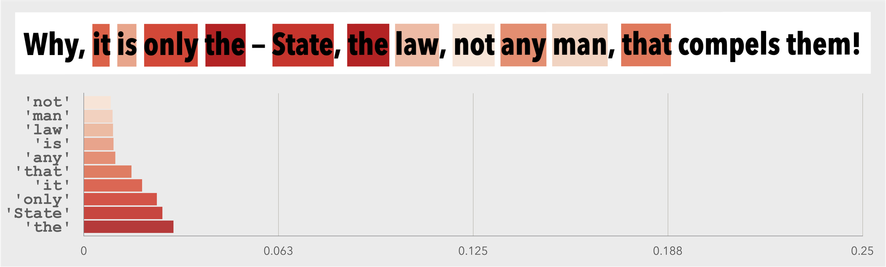
</figure>
<figure>
  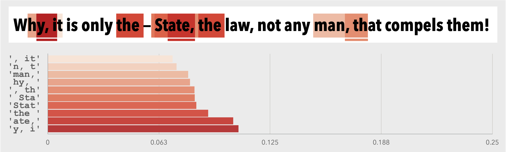
</figure>

 
 

<figure>
  <figcaption>Example 1: Model 2 - original and extended.</figcaption>
  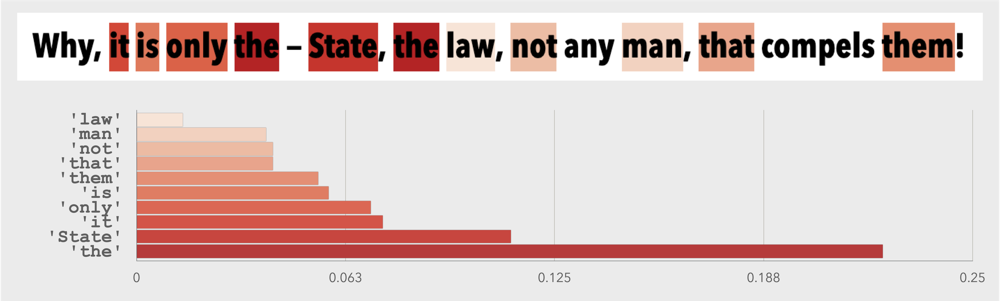
</figure>
<figure>
  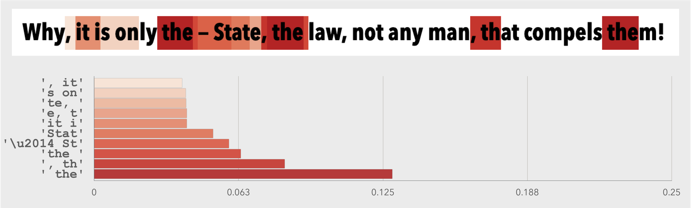
</figure>

 
 

<figure>
  <figcaption>Example 2: Model 1 - original and extended.</figcaption>
  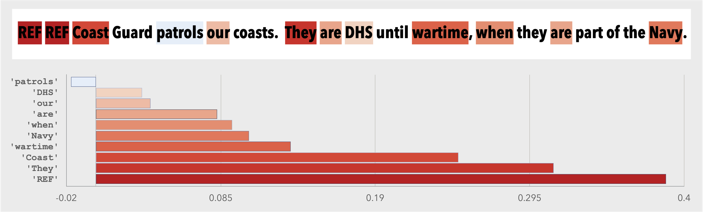
</figure>
<figure>
  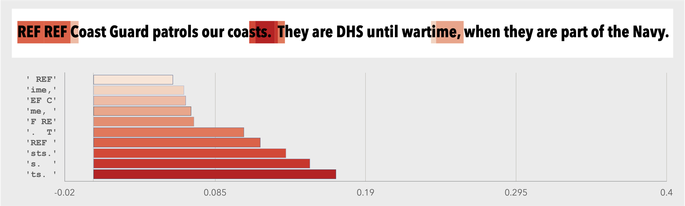
</figure>

 
 

<figure>
  <figcaption>Example 2: Model 2 - original and extended.</figcaption>
  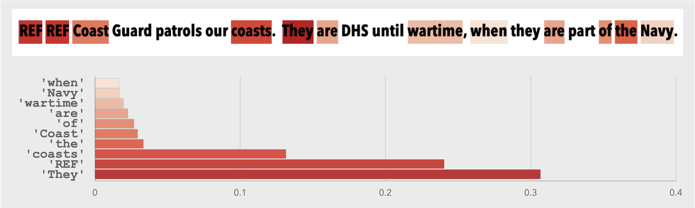
</figure>
<figure>
  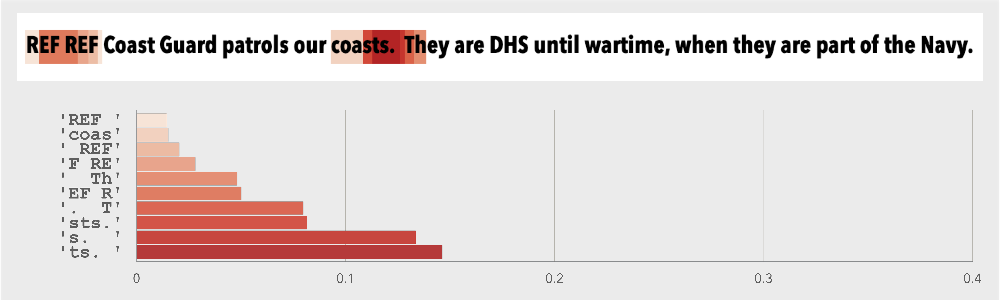
</figure>

 
 

<figure>
  <figcaption>Example 3: Model 1 - original and extended.</figcaption>
  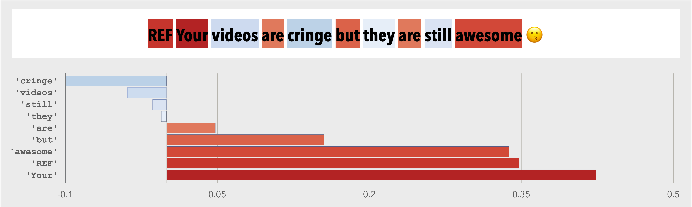
</figure>
<figure>
  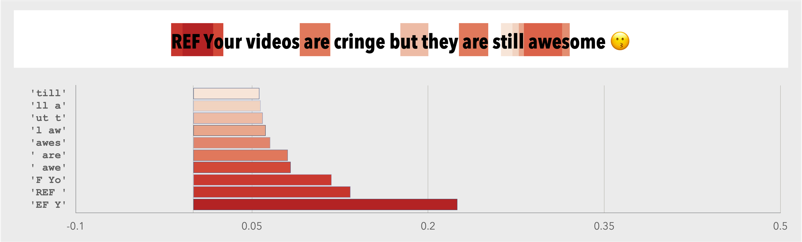
</figure>

 
 

<figure>
  <figcaption>Example 3: Model 2 - original and extended.</figcaption>
  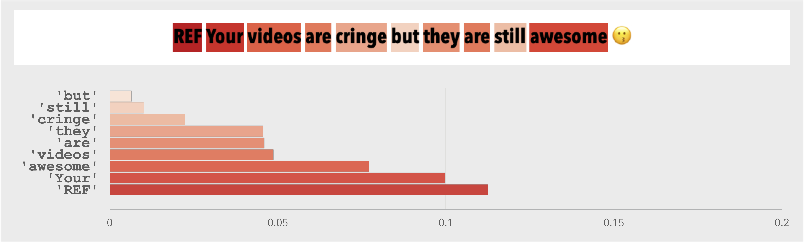
</figure>
<figure>
  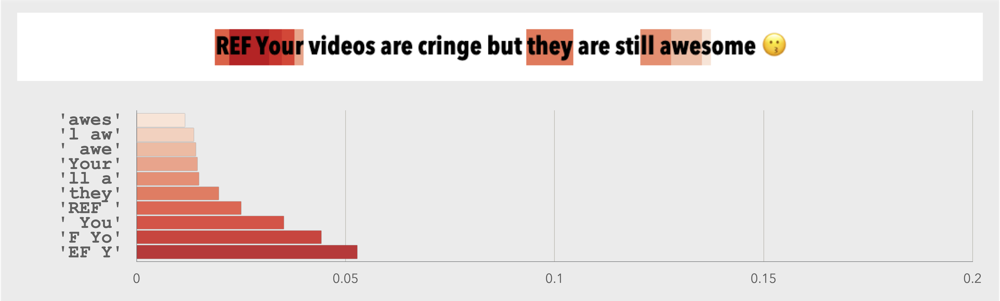
</figure>

 
 

## Section 4.3. Redundancy of Perturbed Samples

Below we see the percentage of duplicated perturbed data for samples in RAND and T-CONF subsets, using unigrams and character 4-grams representations applying the model [1]. A lower rate of duplicates means the method generates more varied and less redundant perturbed samples, which leads to better surrogate models and better explanations.

| **Representation** | **RAND**                 | **T-CONF**               |
| :---               |          :---:           |          :---:           |
|                    | Mean +- Std Dev (Max)    | Mean +- Std Dev (Max)    |
| unigram            | 55.19 +- 19.74 (89.09)   | 51.62 +- 22.06 (91.47)   |
| **char-4-gram**    | **9.84 +- 7.98 (29.73)** | **7.96 +- 6.27 (22.78)** |

Below is the same result for the model [2].

| **Representation** | **RAND**                   | **T-CONF**               |
| :---               |           :---:            |          :---:           |
|                    | Mean +- Std Dev (Max)      | Mean +- Std Dev (Max)    |
| unigram            | 59.34 +- 35.96 (99.96)     | 57.13 +- 32.90 (99.92)   |
| **char-4-gram**    | **10.88 +- 19.32 (99.68)** | **5.12 +- 7.92 (69.44)** |

The difference between the two LIME approaches (unigram and character 4-grams) is significant independently if we consider predictions over random or high confident samples. This indicates that using unigrams to explain the model decisions locally is not recommended for short messages, as they restrict the number of possible perturbations to train the surrogate model.

## Section 4.4. Coverage of Explanations

This section presents the percentage of the most relevant character 4-grams that contain elements missed by unigram LIME (e.g., space, punctuation, and emojis). Character 4-grams capture these elements, and their writing patterns are essential to attribute authorship. However, the original LIME is unable to identify the majority of them, generating poor explanations in the case of authorship attribution of small messages.

The table below presents this measure for models [1] and [2] using the 20 most relevant character 4-grams for each author in the RAND and T-CONF subsets.

| **Model**            | **RAND**              | **T-CONF**            |
| :---                 |        :---:          |         :---:         |
|                      | Mean +- Std Dev (Max) | Mean +- Std Dev (Max) |
| Theophilo et al. [1] | 83.80 +- 10.84 (100)  | 81.70 +- 12.47 (100)  |
| Rocha et al. [2]     | 89.40 +- 8.81 (100)   | 76.86 +- 14.92 (100)  |

 
 

The figures below show the same measure applied to the model [1], but varying the number of relevant character 4-grams in different scenarios.

We can see that, on average, more than 75% of the most relevant character 4-grams contain non-alphabetical elements ignored by the unigram LIME. This is in line with previous works that confirm the importance of these textual elements for authorship attribution of short messages.

<figure>
  
  <figcaption>Percentage of most relevant character 4-grams that contain non-alphanumeric characters (by author in the T-CONF dataset - model [1]).</figcaption>
</figure>

 
 

<figure>
  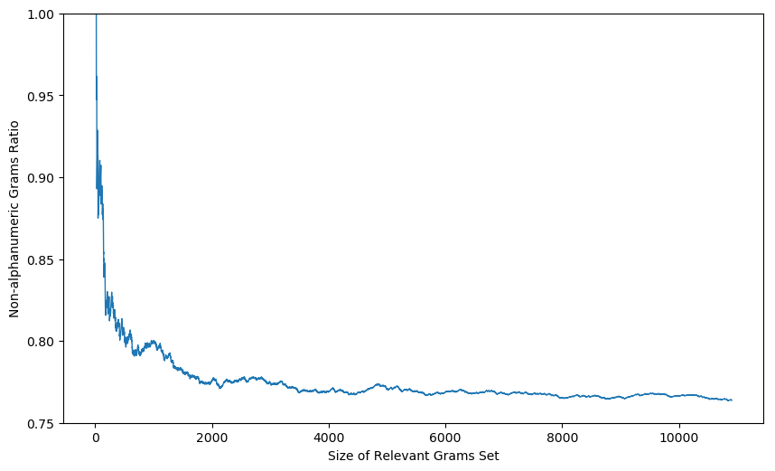
  <figcaption>Percentage of most relevant character 4-grams that contain non-alphanumeric characters (overall in the T-CONF dataset - model [1]).</figcaption>
</figure>

 
 

<figure>
  
  <figcaption>Percentage of most relevant character 4-grams that contain non-alphanumeric characters (by author in the RAND dataset - model [1]).</figcaption>
</figure>

 
 

<figure>
  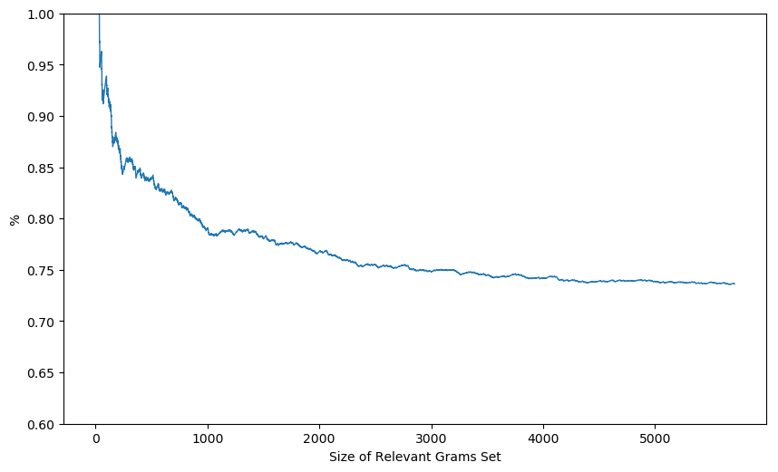
  <figcaption>Percentage of most relevant character 4-grams that contain non-alphanumeric characters (overall in the RAND dataset - model [1]).</figcaption>
</figure>

